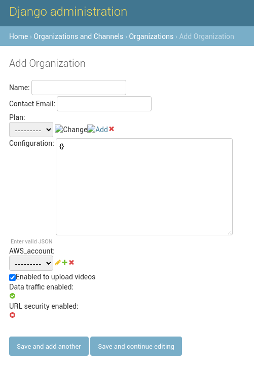

# Configuration

#### Creating another superuser

This should be executed after executing all docker commands. (check: - [Running the application in local environment](#running-the-application-in-local-environment))

1. If not done already, run `docker exec -it video-hub bash` to access the video-hub container.
2. Create a superuser for admin access running `python manage.py createsuperuser`.
3. Go to `http://localhost:8010/admin` and sign in with the superuser credentials.

#### AWS Services Configuration in the Admin Web

In order to apply the following configurations, signing in to admin web is needed.
The "default" intial configurations are created using the configurations inside the `samples` folder, These files can be used as starting point templates to modify in order to create more advanced configurations for their respective services.

1. **CloudFront Configuration:** Inside `Global configuration`, modify and then apply the settings located in `configuration/configuration.samples/cloud_front_configuration`. on the `CloudFront Configuration` input.
2. **MediaConvert Configuration:** Create a `MediaConvert Configuration` and add a name to it, modify and then use the settings found in `configuration/configuration.samples/media_convert_configuration.sample`.
3. **MediaLive Configuration:** Create a `MediaLive Configuration`, add a name to it, modify and then and apply the following configurations:

   - **Input Configuration:** `configuration/configuration.samples/media_live_input_attachments.sample`.
   - **Destination Configuration:** `configuration/configuration.samples/media_live_destinations.sample`.
   - **Encoder Configuration:** `configuration/configuration.samples/media_live_encoder_settings_economic.sample`.

   

#### Creating a Plan

On the `Organizations and Channels` menu choose `Plans` and click on add plan button.


1. **Business name:** Add a name for the plan.
2. **Video transcoding configuration:** From the menu choose the configuration with the name previously created.
3. **Audio transcoding configuration:** From the menu choose the configuration with the name previously created.
4. **MediaLive Configuration:** From the menu choose the configuration needed.


#### Adding a AWS account

On the `Organizations and Channels` menu choose `AWS account` and click on the `add AWS account` button.

1. **Name:** Add a name for the account.
2. **Access Key:** The Access Key for the API user (The user was created in the AWS Configuration section, and the credentials are available in AWS Secrets Manager).
3. **Secret Access Key:** The Secret Access Key for the API user (The user was created in the AWS Configuration section, and the credentials are available in AWS Secrets Manager).
4. **Region:** The region in which your AWS Account is deployed.
5. **MediaConvert Role:** On the AWS IAM service, on the "roles" section there is a search bar, which can be used to get the MediaConvertRole value.
6. **MediaConvert Endpoint URL** This value is on the "account" section of the Media Convert service in AWS.
7. **MediaLive Role:** On the AWS IAM service, on the "roles" section there is a search bar, which can be used to get the MediaLiveAccessRole value.
8. **Account Id:** Your AWS account number.


#### Creating an Organization

On the "Organizations and channels" menu choose "Organization" and click on the "add Organization" button.

1. **Name:** Add a name for your organization. This step will create an s3 bucket with the name of the organization, the name must follow the bucket naming rules: https://docs.aws.amazon.com/AmazonS3/latest/userguide/bucketnamingrules.html .
2. **Plan:** From the menu choose the plan previously created.
3. **AWS Account:** From the menu choose the AWS Account previously created.



#### Associating an Organization to a user

On the "Authentication and Authorization" menu choose "Users" and click on the username to edit.

1. **Organization:** Assign the newly created Organization to the superuser to enable authentication via the User web.


#### Periodic Tasks Configuration

All kind of tasks can be set to run periodically. This can be done on the "Periodic Tasks" menu. (See image below)

1. **Clocked:** Here an specific date and hour can be set to run a task.
2. **Crontabs** Cron configuration, the cron can be configured to run at specific months of the year, specific days of the week, and even specify down to the minute when a particular task should be executed.
3. **Intervals:** Set intervals to wait before running the same task again, it can be set in days, hours, minutes, seconds, and microseconds. 4.**Periodic Tasks** Here a Name must be set for the task, and choose a task from the "Task(registered)" menu. On schedule menu, we can choose previous created options so as to schedule the task.
4. **Solar Events** The task can be executed in a specific zone, this can be set by adding "Latitude" and "Longitude" and selecting one of the solar events from the menu.


#### Custom CSS Configuration for the Player in an Organization

You can provide custom CSS to the player by following these steps

1. Have a URL ready with a CSS file to test (not a local path).
2. In the Organization, add the following line in the organization configuration field:

```
  "playerCustomCss":"https://your-css-url/cssFile.css"
```

If you do not have a CSS URL, you can serve a folder using the npx serve command:

1. Navigate to the folder containing the CSS file you want to use.
2. Run the command 'npx serve .'.
3. Open the server from the browser (probably http://localhost:5000), find the file, and copy the URL.
