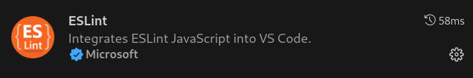
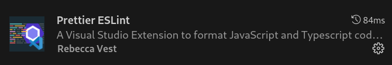
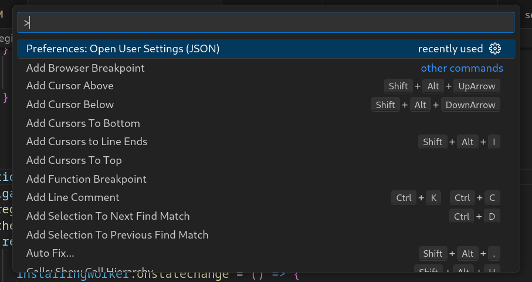

# Video Headline - Contributing

## Table of Contents

- [Running the application in local environment](#running-the-application-in-local-environment)
- [How to build the player](#how-to-build-the-player)
- [How to run the tests](#how-to-run-the-tests)
- [How to use the linters](#how-to-use-the-linters)

### Running the application in local environment

To set up the project locally, follow the instructions provided below.

#### Prerequisites

- AWS Account: Necessary for hosting and delivering video content.
- Docker and Docker compose: Video Headline runs inside Docker containers, so it is necessary to have Docker and Docker Compose installed.
- Yarn and Node.js(v10): Required to deploy AWS configurations and build the playerReact component.
- Python: Necessary for running Django and other Python-based tools.
- AWS CLI: Useful for configuring and managing AWS services from the command line.

#### AWS Configuration

Video Headline requires some IAM roles and permissions. To automate the configuration, there's CDK code to create a Stack with all the requirements.

To deploy this stack, follow this steps:

1. Navigate to the infrastructure directory.
2. Run the command: `yarn cdk deploy AwsConfigurationStack`.

This deployment will set up:

- Api User with permissions for:
  - S3
  - Sns
  - MediaConvert
  - MediaLive
  - Cloudfront
  - Cloudwatch
- Media Convert Role with permissions for:
  - Api Gateway
  - S3
- Media Live Role with permissions for:
  - MediaLive
  - Cloudwatch

#### Set up the application in local environment

To set up the project locally, follow the instructions provided below. If you want to deploy Video Headline in an AWS environment, refer to the [General README](https://github.com/qualabs/video-headline#readme)

#### Create .env file

Create a .env file at the root of the project with all the variables defined in the .env-example file and their respective values.

##### .env variables

1. `DATABASE_HOST`, `DATABASE_PORT`, `DATABASE_USER`, `DATABASE_PASSWORD`: Database credentials for the PostgreSQL database.
   **Note:** If you need to change the database credentials, you need to modify the values in the .env file and also the line 13 in the docker-commands/db_init/init.sh file (`CREATE USER qualabs WITH PASSWORD 'yVm=7>GQ';`) with your new values, since the file does not use the .env variables.
2. `AWS_ACCESS_KEY_ID`, `AWS_SECRET_ACCESS_KEY`, `AWS_DEFAULT_REGION`: these variables can be found in AWS Console > AWS Secret Manager > Secrets > ApiUserSecret
3. `AWS_MEDIA_CONVERT_ROLE`, `AWS_MEDIA_LIVE_ROLE`: these variables can be found in AWS Console > IAM > Roles > MediaConvertRole, MediaLiveAccessRole > ARN
4. `AWS_MEDIA_CONVERT_ENDPOINT`: these variables can be found in AWS Console > AWS Elemental MediaConvert > Account
5. `BASE_URL`: App base endpoint

**Optional: APM_SERVICE_NAME, APM_SECRET_TOKEN, APM_SERVER_URL**: optional Elastic APM credentials for monitoring the application.

#### Running the application

Follow these steps to set up and run the application locally:

1. Create a symbolic link to the appropriate Docker Compose file (`docker-compose.dev.yml` or `docker-compose.prod.yml`) for your environment using the following command `ln -s docker-compose.dev.yml docker-compose.yml`.
2. Run `docker-compose up`.
3. Run `docker exec -it video-hub bash` to access the video-hub container.
4. Create a superuser for admin access running `python manage.py createsuperuser`.
5. Go to `http://localhost:8010/admin` and log in with the username and password provided in the previous step.

**Optional**: If you want to create another superuser:

1. Run `docker exec -it video-hub bash` to access the video-hub container.
2. Create a superuser for admin access running `python manage.py createsuperuser`.

### How to build the player

In Videoheadline we use the playerReact component for video playback. This component is built using React and it is compiled to a CSS and JS file that are used in the Django template that renders the player.
If you need to make changes to the player, you need to follow the steps below to build the player and test it in Videoheadline.

#### Steps to create a new version of the Videoheadline playerReact:

1. Make the changes and compile using `npm run build` inside playerReact folder.
2. Replace the compiled CSS and JS files in player/static/player/css and player/static/player/js, respectively.
3. In the player/templates/player/index.html template, change the names of the CSS and JS files to which the template points.
4. Test in Videoheadline to ensure that the player is working correctly.

### How to run the tests

To run the tests, follow the steps below:

1. Once the docker is running, run the command: `docker exec -it video-hub bash` to access the video-hub container.
2. Run the command: `python manage.py test` to run the tests.

### How to use the linters

If you want to contribute to the project, it is important to use the linters to ensure that the code is consistent and follows the best practices. The linter used in the project is ESLint for JavaScript. In addition, we use Prettier to format the JavaScript code.
We are planning to add a linter and a formatter for Python code in the future.

#### Setting Up ESLint for Linting React in Visual Studio Code

Follow the steps below to set up ESLint for linting React code in Visual Studio Code:

1. Prerequisites:

- Navigate to the `web` folder of the project.

2. Installation:

- Run the command `npm install` to install necessary packages.

3. Configuring Visual Studio Code:

- Ensure you have the following extensions installed:




- Accessing settings:
  - To open the command palette in Visual Studio Code, press Ctrl + Shift + P and select:



- Append the following configurations:
  ```json
  "editor.codeActionsOnSave": { "source.fixAll.eslint": true },
  "editor.formatOnSave": true,
  "[javascriptreact]": {
  	"editor.defaultFormatter": "rvest.vs-code-prettier-eslint"
    },
    "[json]": {
  	"editor.defaultFormatter": "rvest.vs-code-prettier-eslint"
  }
  ```

With these configurations, your React code will be automatically linted and formatted.
