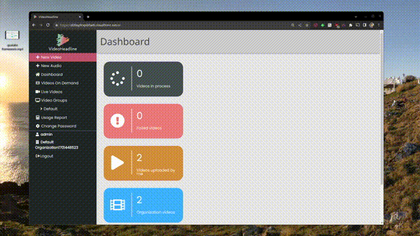
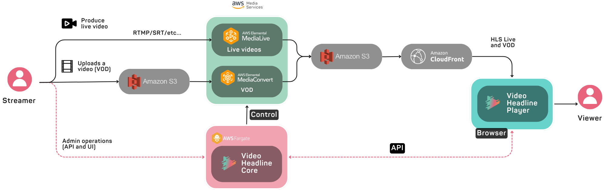

# Video Headline

VideoHeadline is an open-source Content Management System (CMS), designed to help you manage and monetize video content. It is a deployable solution that leverages the power of AWS services to manage and deliver both Video on Demand (VOD) and live video content. Built on the Django web framework, this CMS offers a user-friendly interface for content creators and administrators, making it easy to organize, publish and monitor video content.

## VideoHeadline Key features

- Distribute VOD and Live videos in HLS format worldwide.
- Uplode, transcode and publish VOD and Live content.
- Embed your videos with the built-in video player.
- VAST Support for Cient side AD insertion
- AD blocker detection
- Restful API
- Easy to desploy in your AWS account with just 1 command.

## Deploy VideoHeadline

Deploy a stable version of VideoHeadline using a pre-built docker-hub image for a quick and easy deployment process.
Alternatively, you can build the image locally to deploy a customized version of VideoHeadline, changing the code and its configuration files (see [Table of extra contents](#table-of-extra-contents) for more information).

The default deployment configures everything you need to run VideoHeadline in AWS using Fargate, S3, MediaServices and CloudFront.

### Prerequisites

- AWS account (it's not necessary to have any profile configured locally).
  - If you need help setting up the account or retrieving the set of access key you'll need for the deployment command, please refer to the official AWS documentation
  - [Create a standalone AWS account](https://docs.aws.amazon.com/accounts/latest/reference/manage-acct-creating.html)
  - [Managing access keys for IAM users](https://docs.aws.amazon.com/IAM/latest/UserGuide/id_credentials_access-keys)
  - [Creating access keys for the root user](https://docs.aws.amazon.com/IAM/latest/UserGuide/id_root-user_manage_add-key.htmlhtml#access-keys_required-permissions)
- Docker running on your machine.

### Steps to deploy VideoHeadline infrastructure

1. Run deployment: `docker run -e AWS_ACCESS_KEY_ID=... -e AWS_SECRET_ACCESS_KEY=... -e AWS_SESSION_TOKEN=... -e PROCESS=deploy --rm -it qualabs/video-headline-deploy`

   - `AWS_ACCESS_KEY_ID`: AWS access key identifier.
   - `AWS_SECRET_ACCESS_KEY`: AWS secret access key.
   - `AWS_SESSION_TOKEN`: AWS session token (if required).
   - `AWS_DEFAULT_REGION`: AWS region (optional)
   - If you don't specify a region, the default AWS region will be used, which is "us-east-1."

   These variables can be found in AWS Command line or programmatic access.

2. Once the implementation process has started through the console, you may be asked to confirm with a y/n, please confirm it.

3. The deployment URL of the application will be displayed in the console.

4. A superuser will be created to use in the application, you will be asked via console for the data you want to use. Don't forget the password.

### Accessing the App

Once the app is deployed you can access the web through the previously mentioned url.

- CMS UI: `https://<deployment-url>/`
- Admin UI: `https://<deployment-url>/admin/`
- API Docs: `https://<deployment-url>/api/v1/swagger/`

### Steps to remove VideoHeadline Infrastructure

If you want to remove all the instrastructre in the AWS account just run: `docker run -e AWS_ACCESS_KEY_ID=... -e AWS_SECRET_ACCESS_KEY=... -e AWS_SESSION_TOKEN=... -e PROCESS=destroy --rm -it qualabs/video-headline-deploy`

- `AWS_ACCESS_KEY_ID`: AWS access key identifier.
- `AWS_SECRET_ACCESS_KEY`: AWS secret access key.
- `AWS_SESSION_TOKEN`: AWS session token (if required).
- `AWS_DEFAULT_REGION`: AWS region (optional)
- If you don't specify a region, the default AWS region will be used, which is "us-east-1."

## Table of extra contents

- Deploy VideoHeadline to AWS
  - See [README.md](infrastructure/README.md) within the Infrastructure folder.
- Want to develop locally and contribute?
  - See [CONTRIBUTING.md](CONTRIBUTING.md).
- Want to personalize the AWS Services configurations, users and other settings?
  - See [Configuration.md](CONFIGURATION.md).
