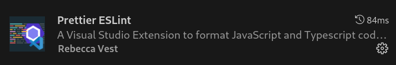

# Video Headline


VideoHeadline is an open-source content management
system (CMS). It is a deployable solution that leverages the power of AWS services to manage and deliver both Video on Demand (VOD) and live video content. Built on the Django web framework, this CMS offers a user-friendly interface for content creators and administrators, making it easy to organize, publish and monitor video content.


## Table of Contents

- [Getting started](#getting-started)
  - [Global configuration (local and AWS environment)](#global-configuration-local-and-aws-environment)
    - [Prerequisites](#prerequisites)
    - [Create .env file](#create-.env-file)
    - [AWS Configuration](#aws-configuration)
  - [Running the application in local environment](#running-the-application-in-local-environment)
    - [Set up and running the application](#set-up-and-running-the-application)
    - [AWS Services Configuration in the Admin Web](#aws-services-configurationiin-the-admin-web)
  - [Running the application in AWS environment](#running-the-application-in-aws-environment)
  - [Production Environment Tasks (optional)](#production-environment-tasks)
  - [Custom CSS Configuration for the Player in an Organization](#Custom-css-configuration-for-the-player-in-an-organization)

## Getting started
### Global configuration (local and AWS environment)
#### Prerequisites

- AWS Account: Necessary for hosting and delivering video content.
- Docker and Docker compose: Video Headline runs inside Docker containers, so it is necessary to have Docker and Docker Compose installed.
- Yarn and Node.js(v10): Required to deploy AWS configurations and build the playerReact component.
- Python: Necessary for running Django and other Python-based tools.
- AWS CLI: Useful for configuring and managing AWS services from the command line.

#### Create .env file

Create a .env file at the root of the project with all the variables defined in the .env-example file and their respective values.

#### AWS Configuration
Video Headline requires some IAM roles and permissiones. To automate the configuration, there's CDK code to create a Stack with all the requirements.

To deploy this stack, follow this steps:
1. Navigate to the infrastructure directory.
2. Run the command: `yarn cdk deploy AwsConfigurationStack`.

This deployment will set up:

- Api User with permissions for:
  - S3
  - Sns
  - MediaConvert
  - MediaLive
  - Cloudfront
  - Cloudwatch
- Media Convert Role with permissions for:
  - Api Gateway
  - S3
- Media Live Role with permissions for:
  - MediaLive
  - Cloudwatch

### Running the application in local environment
To set up the project locally, follow the instructions provided below. For AWS deployment, refer to the README within the Infrastructure folder.

**Environment Variables:** Add `AWS_MEDIA_CONVERT_ROLE` and `AWS_MEDIA_LIVE_ROLE` with respective ARNs to your Docker Compose file based on your environment (`docker-compose.dev.yml` or `docker-compose.prod.yml`).

#### Set up and running the application

Follow these steps to set up and run the application locally:

1. Create a symbolic link to the appropriate Docker Compose file (`docker-compose.dev.yml` or `docker-compose.prod.yml`) for your environment using `ln -s docker-compose.dev.yml docker-compose.yml`.
2. Run `docker-compose up`.
3. Run `docker exec -it video-hub bash` to access the video-hub container.
4. Create a superuser for admin access running `python manage.py createsuperuser`.
5. Go to `http://localhost:8010/admin` and log in with the superuser credentials.


### Running the application in AWS environment
For AWS deployment, refer to the [README](infrastructure/README.md) within the Infrastructure folder.

### Production Environment Tasks (optional)

1. Schedule the following `Periodic Tasks` for MediaLive, CloudFront, and bill renewals:
   - `delete_channels` every hour.
   - `delete_inputs` every hour.
   - `check_live_cuts` every minute.
   - `delete_distributions` daily.
   - `bill_renewal` on the first day of every month.
2. If enabling statistics, set up qtracking for the organization.
3. If there are any modifications to the player, it’s essential to generate a new build.

### Custom CSS Configuration for the Player in an Organization

1. Have a URL ready with a CSS file to test (not a local path).
2. In the Organization, add the following line in the organization configuration field:

```
  "playerCustomCss":"https://your-css-url/cssFile.css"
```

If you do not have a CSS URL, you can serve a folder using the npx serve command: 1. Navigate to the folder containing the CSS file you want to use. 2. Run the command 'npx serve .'. 3. Open the server from the browser (probably http://localhost:5000), find the file, and copy the URL.

### Setting Up ESLint for Linting React in Visual Studio Code
Follow the steps below to set up ESLint for linting React code in Visual Studio Code:
1. Prerequisites:
  - Navigate to the `web` folder of the project.
2. Installation:
  - Run the command `npm install` to install necessary packages.
3. Configuring Visual Studio Code:
  - Ensure you have the following extensions installed:




  - Accessing settings:
    - To open the command palette in Visual Studio Code, press Ctrl + Shift + P and select:


  - Append the following configurations:
    ```json
    "editor.codeActionsOnSave": { "source.fixAll.eslint": true },
    "editor.formatOnSave": true,
    "[javascriptreact]": {
    	"editor.defaultFormatter": "rvest.vs-code-prettier-eslint"
	  },
	  "[json]": {
    	"editor.defaultFormatter": "rvest.vs-code-prettier-eslint"
    }
    ```

With these configurations, your React code will be automatically linted and formatted.
